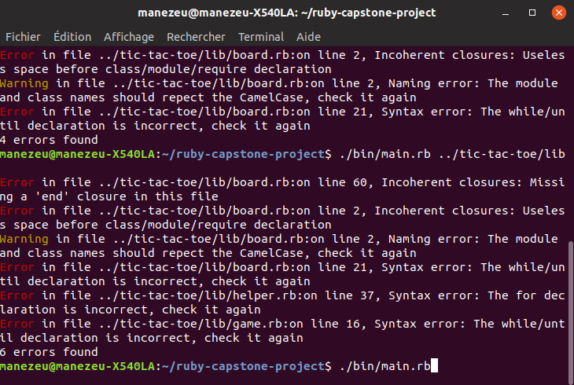
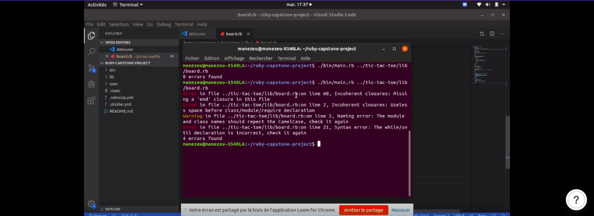

# Ruby Capstone project

> Ruby code linter

This is a basic and simple linter to help you check your ruby code. These are the good and bad it checks on:
#### Respect of CamelCase and namespacing for modules, class and method name
   ** Bad **
   `class myClass`
   ** Good **
   `class MyClass`
#### Respect of syntax for condition and itteration declaration
   ** Bad **
   `ifmycondition` or `myarray .times do {|i| print i}`
   ** Good **
   `if mycondition` or `myarray.times do |i|` or `myarray.times {|i| print i}`
#### Corresponding end for each oppening line
   ** Bad **
   `class MyClass def my_function end` 
   ** Good **
   `class MyClass def my_function end end`

> Watch the presentation video.

## Built With

- Ruby
- VSCode, Linters, Rubocop

## Getting Started

**This is an example of how you may give instructions on setting up your project locally.**
**Modify this file to match your project, remove sections that don't apply. For example: delete the testing section if the currect project doesn't require testing.**

To get a local copy up and running follow these simple example steps.

### Prerequisites

- Get ruby latest version installed

### Setup

- Clone the repository on your local machine

### Install

- type this in order to install colorize gem: `gem install colorize`
- Install Ruby(most recent version)
- Run this command on your terminal in order to install rubocop: gem install rubocop 
- Run this command in order to get make the project file runable:
   `chmod +x path_to_the_linter_project/bin/main.rb`

### Usage

### Run tests

You can run the linter on a file, a folder or the current folder by typing this command:
- `./path_to_the_linter_project/bin/main.rb myfile.rb` for a particular file
- `./path_to_the_linter_project/bin/main.rb myfolder` for all the ruby files in a particular folder
- `./path_to_the_linter_project/bin/main.rb` for all the ruby files in the current folder

## Authors

👤 **Manezeu Patricia Chrystelle**

- Github: [@githubhandle](https://github.com/patriciachrysy)
- Twitter: [@twitterhandle](https://twitter.com/ManezeuP)
- Linkedin: [linkedin](https://www.linkedin.com/in/manezeu-patricia-chrystelle-095072118/)

## 🤝 Contributing

Contributions, issues and feature requests are welcome!

Feel free to check the [issues page]().

## Show your support

Give a ⭐️ if you like this project!

## Acknowledgments

- Hat tip to anyone whose code was used
- Inspiration
- etc

## 📝 License

